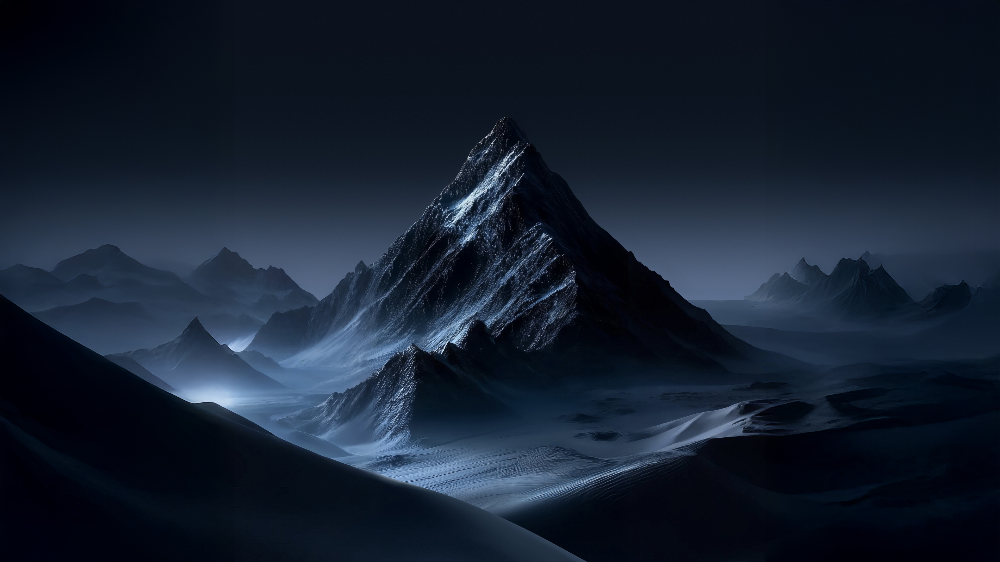

# Mountain Landscape

A dark mountain landscape theme for Omarchy — near-black blue backgrounds with soft slate-blue accents and icy cyan highlights.



## Install

```bash
omarchy theme install https://github.com/Davedes83/omarchy-mountain-landscape-theme
```

## Colors

| Role    | Color | Hex       |
| ------- | ----- | --------- |
| Background   |       | `#000008` |
| Dark Background |  | `#000006` |
| Darker Background | | `#000004` |
| Lighter Background | | `#1a1a21` |
| Foreground |      | `#a9c2e1` |
| Accent   |       | `#798cb2` |
| Selection |      | `#1a1a21` |
| Muted    |       | `#64666c` |
| Red      |       | `#958cb2` |
| Yellow   |       | `#b3fbff` |
| Orange   |       | `#a59dbe` |
| Green    |       | `#93c8e5` |
| Cyan     |       | `#a7ddff` |
| Blue     |       | `#6b7ea3` |
| Magenta  |       | `#9fa4d9` |
| Brown    |       | `#635e72` |

## Files

- `colors.toml` — theme palette (generated by Aether for Omarchy v4)
- `icons.theme` — icon theme (Yaru-blue)
- `backgrounds/mountain-landscape.jpg` — wallpaper